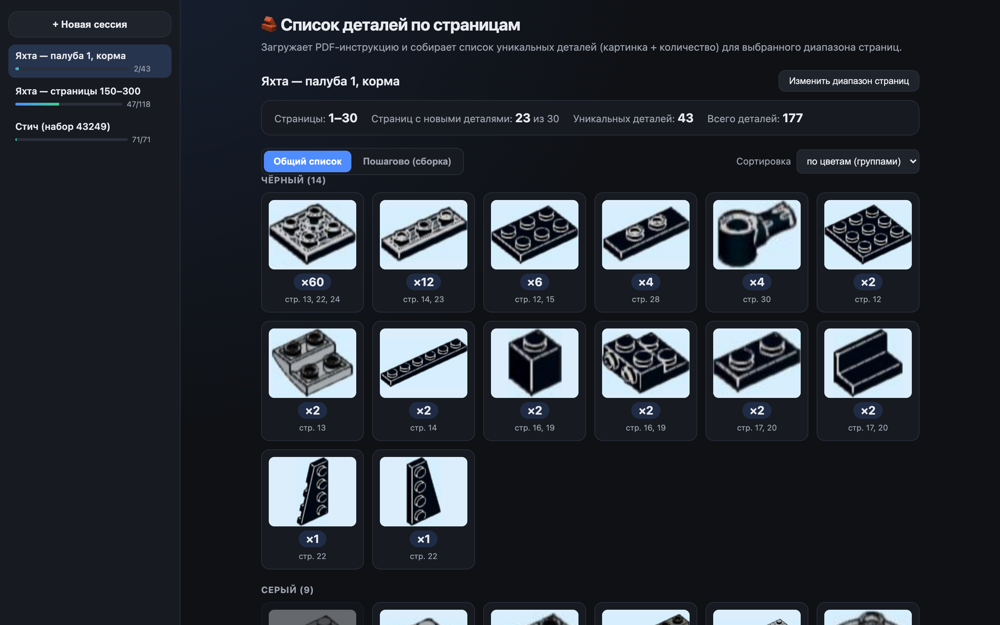

# 🧱 LEGO — список деталей по страницам инструкции

[](https://github.com/bogggare567/yakushin/tags)
[](LICENSE)


Загружаешь PDF-инструкцию, указываешь диапазон страниц (например 250–400) — получаешь список всех деталей, которые нужны на этих страницах: картинка, суммарное количество, и на каких страницах встречается. Больше не нужно вручную пролистывать одни и те же страницы по разу на каждый цвет.



Есть два режима просмотра:
- **Общий список** — все детали диапазона одной сеткой, с сортировкой (по количеству, по цвету, по странице). По цветам детали группируются не по жёстким границам, а по тому, какие цвета реально встретились в этом диапазоне — похожие оттенки (например салатовый между жёлтым и зелёным) получают свою отдельную группу, если их достаточно, а не растворяются в соседней.
- **Пошагово (сборка)** — идёшь по страницам вперёд-назад, видишь саму страницу инструкции, что нужно именно на ней, и сколько деталей ещё осталось найти до конца диапазона (счётчик уменьшается по мере продвижения).

**Всё считается прямо в браузере, PDF никуда не отправляется.** Инструкции обычно продаются с лицензией «только для личного использования», поэтому обработка происходит локально, на устройстве пользователя.

---

## Как запустить

Один файл, один двойной клик — больше ничего устанавливать не нужно (кроме Python на Windows, см. ниже). Он сам определяет, есть ли Wi-Fi:

- **Mac** — дважды кликнуть `desktop/mac/Start.command`.
- **Windows** — дважды кликнуть `desktop/windows/Start.bat`. Нужен Python — на Windows он не встроен, поставить с [python.org](https://www.python.org/downloads/), отметить галочку **Add python.exe to PATH** при установке.
- **С телефона/планшета через GitHub Pages (без компьютера рядом)** — включить GitHub Pages для этого репозитория (Settings → Pages → Branch `main`, папка `/webapp`) и открыть выданную ссылку.

Если Wi-Fi есть — откроется адрес вида `http://192.168.х.х:8934/`, и на странице появится баннер «Открыть на телефоне» с кнопкой **Показать QR**: сканируете камерой телефона и попадаете на тот же сайт. Пока оба устройства открыты так, они ещё и **синхронизированы** — любое из двух может быть и пультом, и источником:
- переключение страницы/режима/сортировки на одном устройстве тут же отражается на другом;
- выбрали PDF и диапазон на телефоне — компьютер сам подхватит тот же файл и результат, и наоборот.

Если Wi-Fi не нашёлся — скрипт просто откроет сайт локально (без телефона и синхронизации, но всё остальное работает как обычно).

### Если Mac ругается («Не удаётся открыть», «повреждено», «разработчик не может быть проверен»)

Это стандартная защита Gatekeeper для файлов без сертификата Apple — программа тут ни при чём. Самый надёжный способ снять блокировку (нужно один раз, через Терминал):

```bash
xattr -cr "путь/до/папки/yakushin"
```
(перетащите папку репозитория в окно Терминала после `xattr -cr ` вместо того, чтобы печатать путь руками — Terminal сам подставит его). После этого всё открывается обычным двойным кликом.

Если и это не помогает — **Системные настройки → Конфиденциальность и безопасность**, прокрутить вниз, там будет строка про заблокированный файл с кнопкой **«Открыть в любом случае»**.

## Как пользоваться

1. Открыть сайт, нажать «Выберите файл» и указать PDF-инструкцию.
2. Указать диапазон страниц.
3. Нажать «Собрать список деталей».
4. Переключаться между «Общий список» и «Пошагово», сортировать как удобно.
5. В пошаговом режиме можно нажать на картинку страницы, чтобы открыть её крупнее на весь экран.
6. Нажатие на деталь в общем списке помечает её как уже найденную (тускнеет и перечёркивается) — просто чтобы не потерять место, пока собираешь. Нажатие повторно снимает отметку.
7. «Изменить диапазон страниц» над списком результатов позволяет пересчитать тот же файл для другого диапазона, не выбирая PDF заново — файл уже загружен и лежит в памяти.

Если у детали количество помечено `?` — распознавание не до конца уверено в цифре, стоит перепроверить на странице глазами (на реальном файле такое практически не встречается).

### Сессии (боковая панель слева)

Каждый собранный список запоминается локально в браузере (IndexedDB, ничего не уходит в сеть) — включая сам PDF-файл (одна копия на файл, даже если из него сделано несколько сессий с разными диапазонами страниц), диапазон, сортировку, текущую страницу и все отметки «уже собрано». Слева — панель сессий, как список чатов:

- клик по сессии открывает её заново на той же странице, с теми же отметками — файл выбирать не нужно, никакого повторного анализа;
- «+ Новая сессия» наверху — чистый экран загрузки нового PDF, текущая сессия при этом никуда не девается;
- название можно поменять — двойной клик по нему, напечатать своё, Enter (одиночный клик по названию не переименовывает, чтобы не мешать обычному клику для перехода);
- полоска прогресса — это прогресс чтения по страницам (как процент прочитанной книги), рядом — сколько деталей уже отмечено собранными;
- крестик у сессии её удаляет.

Если браузер уже успел вытеснить сохранённый PDF из хранилища (например, не хватило места), при открытии такой сессии появится подсказка выбрать тот же файл заново — диапазон страниц и все отметки при этом восстановятся автоматически, как только файл будет выбран.

Сессии живут только в этом браузере на этом устройстве — на телефоне и компьютере (даже синхронизированных по Wi-Fi) списки сессий отдельные.

При запуске через `Start.command`/`Start.bat` сайт сам подтягивает последнюю версию из репозитория (`git pull`, только если нет локальных изменений) — обновлять вручную не нужно, следующий запуск уже будет актуальным. Это не работает при открытии `webapp/index.html` напрямую или через GitHub Pages — там при каждом открытии сайт лишь негромко сверяет версию с GitHub и показывает баннер со ссылкой, если есть новее.

---

## Ограничения

- Шаблоны цифр для распознавания количества вытащены из конкретной инструкции (`2.2-Super Yacht Deck 1 STERN 2.pdf`). Другие буклеты той же серии должны читаться так же хорошо. Для инструкции от другого автора/генератора точность может просесть — см. `tools/` ниже.
- Цифра «9» в исходных страницах ни разу не встретилась, вместо неё используется приближение (шаблон «6», повёрнутый на 180°).
- На очень старых телефонах обработка большого диапазона (сотни страниц) может идти медленнее — вся работа выполняется на самом устройстве.

---

## Для разработчиков

`webapp/` — исходный код сайта (`index.html`, `style.css`, `app.js`, `glyph-templates.js`). Открыть `webapp/index.html` напрямую или поднять локальный сервер (`python3 -m http.server 8080` из папки `webapp`).

`desktop/mac/Start.command` и `desktop/windows/Start.bat` — лаунчеры, оба просто ссылаются на `webapp/` напрямую (никаких копий для синхронизации не нужно).

`tools/lan_server.py` — то, что запускает `Start`: раздаёт `webapp/` как обычный статический сервер плюс небольшой JSON/бинарный API (`/api/state`, `/api/pdf`) для синхронизации между устройствами. Только стандартная библиотека Python, без зависимостей.

`tools/` (остальное) — Python-скрипты, которыми были получены эталоны цифр в `glyph-templates.js` (и вспомогательный скрипт для проверки алгоритма вне браузера). Нужны только для пересборки шаблонов под новый шрифт/генератор инструкций — для обычного использования сайта не требуются. Установка: `cd tools && python3 -m venv venv && source venv/bin/activate && pip install -r requirements.txt` (на Windows — `venv\Scripts\activate`). Дальше: `extract_glyph_templates.py <pdf> <out_dir> <from> <to>` → посмотреть кластеры → прописать соответствие цифрам в `export_templates.py` → `export_templates.py <out_dir> ../webapp/glyph-templates.js`.

### Выпуск новой версии

Обновить `webapp/version.json` (поле `version`) и версию `APP_VERSION` в начале `webapp/app.js` — иначе баннер обновления будет неточным.
