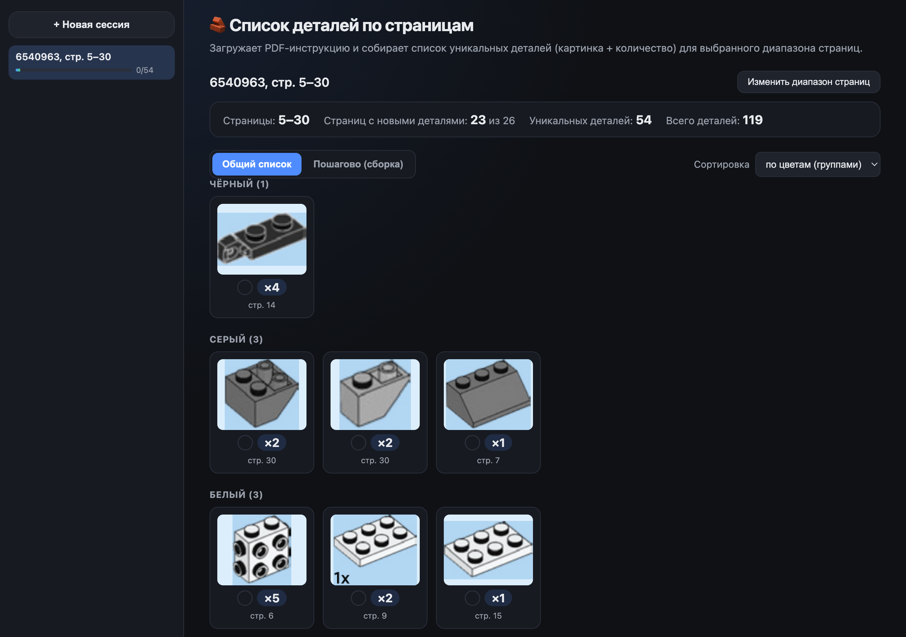
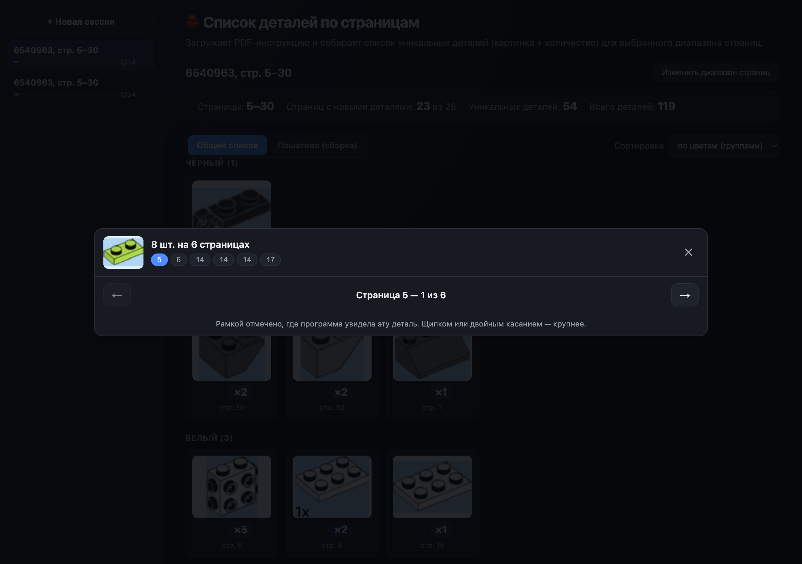
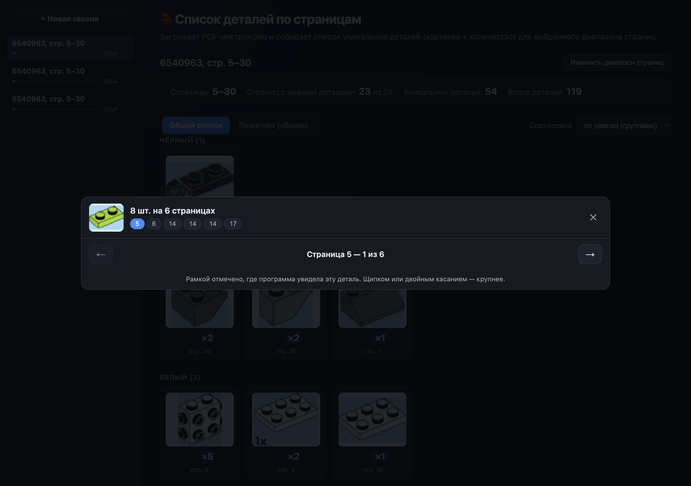
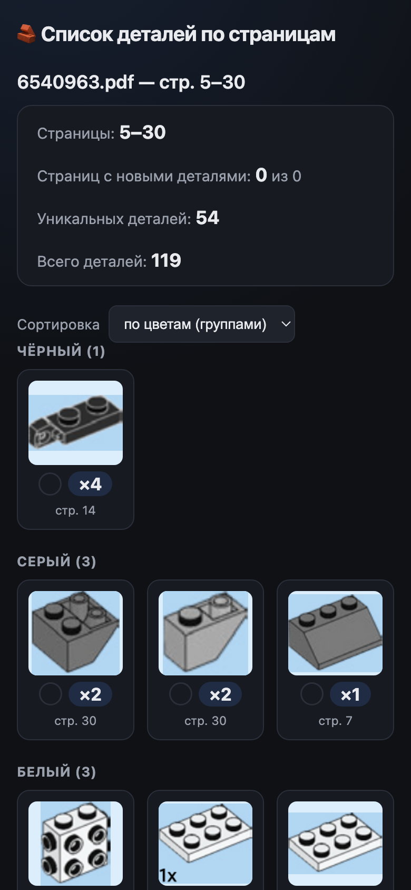
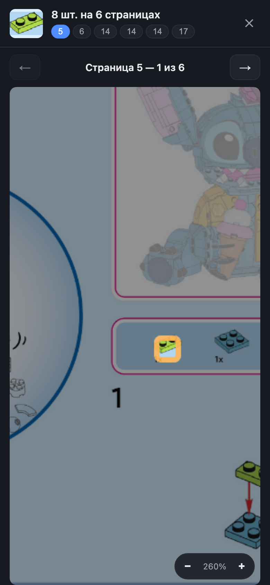
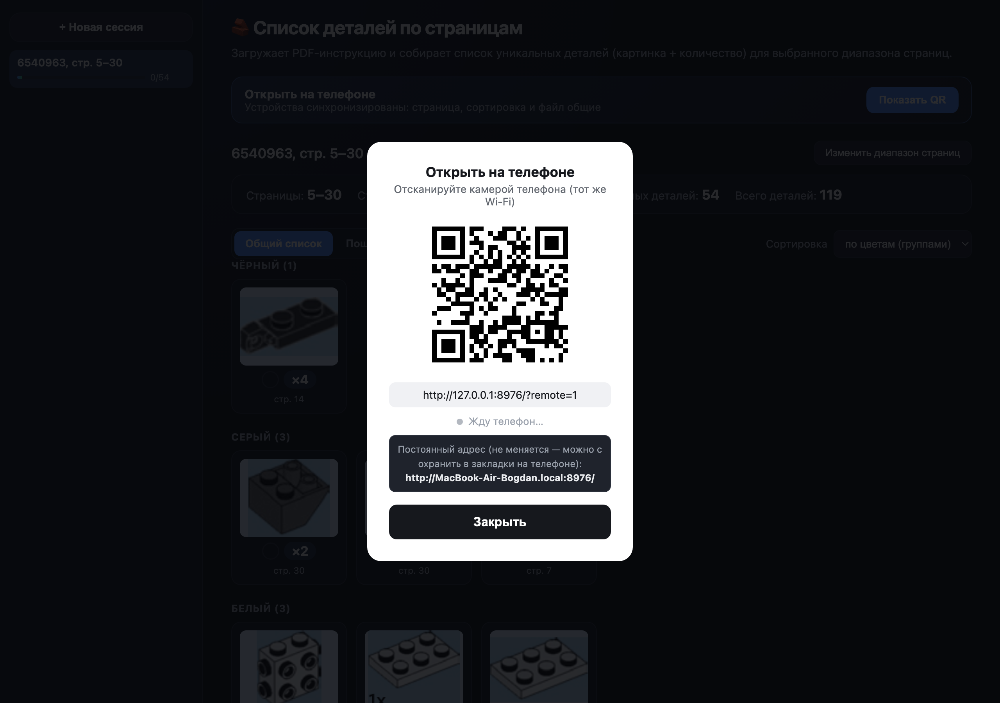
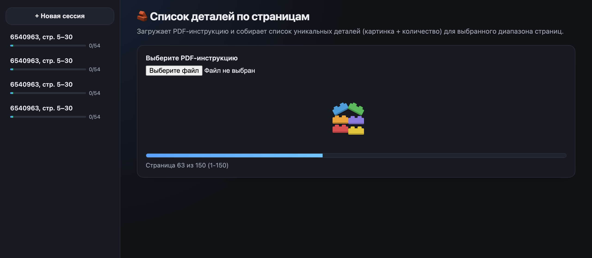

# 🧱 LEGO — список деталей по страницам инструкции

[](https://github.com/bogggare567/yakushin/tags)
[](LICENSE)

[](https://github.com/bogggare567/yakushin/actions/workflows/ci.yml)

Загружаешь PDF-инструкцию, указываешь диапазон страниц (например 250–400) — получаешь список всех деталей, которые нужны на этих страницах: картинка, суммарное количество, и на каких страницах встречается. Больше не нужно вручную пролистывать одни и те же страницы по разу на каждый цвет.



### Что видно на экране

| | |
|---|---|
|  |  |
| **Нажатие на деталь** открывает страницы, где она встречается, и обводит рамкой то место, которое программа приняла за неё. Это самый быстрый способ проверить, не ошиблось ли распознавание. | **Щипок, колесо или двойное касание** приближают страницу до шести раз — рамка едет вместе с ней. Всё остальное на экране остаётся на месте. |
|  |  |
| **Телефон как пульт.** Он не получает PDF и ничего не считает: список приходит с компьютера готовым, отметки «нашёл» летят обратно. | **Страницы на телефоне тоже есть.** Он просит страницу по номеру, компьютер её рисует и оставляет на себе — по одной, только когда на неё смотрят. |
|  |  |
| **QR сам следит, дошёл ли телефон** — пока тихо, так и написано, а как только телефон появится, скажет об этом. Если тишина затянется, откроется список причин и другие адреса компьютера. Ниже — постоянный адрес, который не меняется от перезагрузки роутера. | **Пока идёт разбор** — детали складываются в домик, потом в фигурку, раскладываются по цветам, и на них наступают. |

Есть два режима просмотра:
- **Общий список** — все детали диапазона одной сеткой, с сортировкой (по количеству, по цвету, по странице). По цветам детали группируются не по жёстким границам, а по тому, какие цвета реально встретились в этом диапазоне — похожие оттенки (например салатовый между жёлтым и зелёным) получают свою отдельную группу, если их достаточно, а не растворяются в соседней.
- **Пошагово (сборка)** — идёшь по страницам вперёд-назад, видишь саму страницу инструкции, что нужно именно на ней, и сколько деталей ещё осталось найти до конца диапазона (счётчик уменьшается по мере продвижения).

**Всё считается прямо в браузере, PDF никуда не отправляется.** Инструкции обычно продаются с лицензией «только для личного использования», поэтому обработка происходит локально, на устройстве пользователя.

---

## Как запустить

Один файл, один двойной клик — больше ничего устанавливать не нужно (кроме Python на Windows, см. ниже). Он сам определяет, есть ли Wi-Fi:

- **Mac** — дважды кликнуть `desktop/mac/Start.command`.
- **Windows** — дважды кликнуть `desktop/windows/Start.bat`. Нужен Python — на Windows он не встроен, поставить с [python.org](https://www.python.org/downloads/), отметить галочку **Add python.exe to PATH** при установке.
- **С телефона/планшета через GitHub Pages (без компьютера рядом)** — включить GitHub Pages для этого репозитория (Settings → Pages → Branch `main`, папка `/webapp`) и открыть выданную ссылку.

Если Wi-Fi есть — откроется адрес вида `http://192.168.х.х:8934/`, и на странице появится баннер «Открыть на телефоне» с кнопкой **Показать QR**: сканируете камерой телефона и попадаете на тот же список.

**Телефон при этом — пульт, а не вторая копия программы.** Он не получает PDF и не разбирает его заново: считает компьютер, у которого есть файл и время, а телефон показывает готовое. Это сознательно:

- список деталей приходит на телефон готовым, сразу после разбора;
- отметки «нашёл» летят в обе стороны — отметили на телефоне, на компьютере тоже зачеркнулось;
- **страницы инструкции на телефоне тоже открываются**: он просит нужную по номеру, компьютер её рисует и оставляет у себя, телефон забирает. По одной странице, только когда на неё смотрят — сотни страниц по Wi-Fi ради одного взгляда никто не гоняет;
- страницу можно приближать щипком или двойным касанием, рамка на детали едет вместе с изображением.

Окно с QR само пишет, подключился телефон или нет — сервер видит, с каких адресов к нему приходили. Если полминуты тихо, там же появится короткий список причин и другие адреса этого компьютера кнопками (у ноутбука их обычно несколько, и «главный» не всегда тот, что нужен).

Если Wi-Fi не нашёлся — скрипт просто откроет сайт локально (без телефона и синхронизации, но всё остальное работает как обычно).

### Как работает синхронизация с телефоном

Отдельного «сервера в интернете» нет: **компьютер сам становится сервером**, а телефон подключается к нему напрямую. Отсюда единственное жёсткое требование:

> **Оба устройства должны быть в одной локальной сети.** Телефон по Wi-Fi, компьютер по Wi-Fi или по кабелю в тот же роутер — годится. Телефон по мобильному интернету — не годится.

Кто кому что передаёт: устройство, на котором **показан QR**, раздаёт файл и состояние; устройство, которое **отсканировало**, их получает. Дальше связь двусторонняя — листаете страницу на любом из двух, второй повторяет; выбрали PDF и диапазон на телефоне — компьютер подхватит их сам.

**Если общего Wi-Fi нет** (например, у компьютера нет Wi-Fi-модуля или он не умеет раздавать сеть) — самый простой обходной путь в обратную сторону: **раздать интернет с телефона** (iPhone: Настройки → Режим модема) и подключить к этой раздаче компьютер. Оба окажутся в одной сети, и всё заработает так же — QR по-прежнему показывается на компьютере.

### Если на телефоне не открывается

Пройдите по списку сверху вниз — почти всегда причина в первых трёх пунктах.

1. **Адрес устарел.** Роутер периодически выдаёт компьютеру новый IP, и сохранённая ссылка вида `192.168.х.х` перестаёт работать. Поэтому при запуске печатается второй, **постоянный** адрес вида `http://Имя-Компьютера.local:8934/` (он же под QR-кодом) — он не меняется, его и стоит держать в закладках.
2. **Телефон не в той сети.** Проверьте, что это та же сеть, а не соседняя/гостевая, и что телефон не ушёл в мобильный интернет: временно выключите сотовые данные (Настройки → Сотовая связь) и попробуйте снова.
3. **Гостевая сеть или «изоляция клиентов»** (в роутере может называться AP isolation, Client isolation, «Изоляция точки доступа»). Она специально запрещает устройствам видеть друг друга — синхронизация в ней невозможна в принципе. Подключитесь к основной сети или отключите изоляцию в настройках роутера.
4. **iCloud Private Relay / «Ограничить трекинг IP-адреса».** Настройки → Wi-Fi → (i) у вашей сети → выключить **«Ограничить трекинг IP-адреса»**. По [документации Apple](https://support.apple.com/en-us/102602) Private Relay работает только в Safari, но именно он чаще всего мешает локальным адресам.
5. **VPN.** Любой включённый VPN уводит трафик мимо локальной сети — выключите на время.
6. **Блокировщики контента** в Safari (Настройки → Приложения → Safari → Расширения / Блокировщики) — временно отключите.
7. **Другой браузер на телефоне.** Safari на iOS обращается к локальным адресам без отдельного разрешения, а вот **сторонним приложениям** (Chrome, Firefox) начиная с iOS 14 нужно разрешение «Локальная сеть»: Настройки → Конфиденциальность и безопасность → **Локальная сеть** → включить для этого браузера. Подробности — в [материалах Apple для разработчиков](https://developer.apple.com/news/?id=0oi77447); отмечу, что в iOS 18 у этого механизма [встречаются собственные сбои](https://developer.apple.com/forums/thread/788044), так что если в стороннем браузере не выходит — проверьте в Safari.
8. **Порт.** Используется 8934 — он не входит в список портов, которые браузеры блокируют сами, так что менять его обычно не нужно. Если порт занят другой программой, запуск это заметит и подскажет.

Быстрая проверка «а виноват ли телефон»: откройте тот же адрес в браузере **на самом компьютере**. Если там открывается, а на телефоне нет — дело в сети или в пунктах 2–7 выше.

### Если Mac ругается («Не удаётся открыть», «повреждено», «разработчик не может быть проверен»)

Это стандартная защита Gatekeeper для файлов без сертификата Apple — программа тут ни при чём. Самый надёжный способ снять блокировку (нужно один раз, через Терминал):

```bash
xattr -cr "путь/до/папки/yakushin"
```
(перетащите папку репозитория в окно Терминала после `xattr -cr ` вместо того, чтобы печатать путь руками — Terminal сам подставит его). После этого всё открывается обычным двойным кликом.

Если и это не помогает — **Системные настройки → Конфиденциальность и безопасность**, прокрутить вниз, там будет строка про заблокированный файл с кнопкой **«Открыть в любом случае»**.

## Как пользоваться

1. Открыть сайт, нажать «Выберите файл» и указать PDF-инструкцию.
2. Указать диапазон страниц.
3. Нажать «Собрать список деталей».
4. Переключаться между «Общий список» и «Пошагово», сортировать как удобно.
5. В пошаговом режиме можно нажать на картинку страницы, чтобы открыть её крупнее на весь экран.
6. Нажатие на деталь в общем списке помечает её как уже найденную (тускнеет и перечёркивается) — просто чтобы не потерять место, пока собираешь. Нажатие повторно снимает отметку.
7. «Изменить диапазон страниц» над списком результатов позволяет пересчитать тот же файл для другого диапазона, не выбирая PDF заново — файл уже загружен и лежит в памяти.
8. **Нажатие на деталь открывает страницы, где она встречается** — можно пролистать только эти страницы (стрелками, клавишами ←/→ или по номеру страницы), и на каждой рамкой отмечено то место, которое программа приняла за эту деталь. Это самый быстрый способ проверить, не ошиблось ли распознавание. Страницу можно приблизить щипком, колесом мыши или двойным касанием — до шести раз, рамка едет вместе с ней.
9. Под некоторыми деталями подписан **размер в шипах** («4×2»). Он не угадывается по пропорциям, а считается по самим шипам, и печатается только тогда, когда счёт сошёлся: у скосов, плиток и круглых деталей подписи не будет, и это правильно.

Галочка в углу карточки отмечает деталь как уже найденную (она тускнеет и перечёркивается) — это отдельная кнопка, чтобы нажатие на саму карточку открывало страницы.

Если у детали количество помечено `?` — распознавание не до конца уверено в цифре, стоит перепроверить на странице глазами (на реальном файле такое практически не встречается).

### Сессии (боковая панель слева)

Каждый собранный список запоминается локально в браузере (IndexedDB, ничего не уходит в сеть) — включая сам PDF-файл (одна копия на файл, даже если из него сделано несколько сессий с разными диапазонами страниц), диапазон, сортировку, текущую страницу и все отметки «уже собрано». Слева — панель сессий, как список чатов:

- клик по сессии открывает её заново на той же странице, с теми же отметками — файл выбирать не нужно, никакого повторного анализа;
- «+ Новая сессия» наверху — чистый экран загрузки нового PDF, текущая сессия при этом никуда не девается;
- название можно поменять — двойной клик по нему, напечатать своё, Enter (одиночный клик по названию не переименовывает, чтобы не мешать обычному клику для перехода);
- полоска прогресса — это прогресс чтения по страницам (как процент прочитанной книги), рядом — сколько деталей уже отмечено собранными;
- крестик у сессии её удаляет.

Если браузер уже успел вытеснить сохранённый PDF из хранилища (например, не хватило места), при открытии такой сессии появится подсказка выбрать тот же файл заново — диапазон страниц и все отметки при этом восстановятся автоматически, как только файл будет выбран.

Сессии живут только в этом браузере на этом устройстве — на телефоне и компьютере (даже синхронизированных по Wi-Fi) списки сессий отдельные.

При запуске через `Start.command`/`Start.bat` сайт сам подтягивает последнюю версию из репозитория (`git pull`, только если нет локальных изменений) — обновлять вручную не нужно, следующий запуск уже будет актуальным. Это не работает при открытии `webapp/index.html` напрямую или через GitHub Pages — там при каждом открытии сайт лишь негромко сверяет версию с GitHub и показывает баннер со ссылкой, если есть новее.

---

## Ограничения

Написано по итогам проверки на восьми буклетах трёх разных оформлений.

- **Цвет выносок и шрифт цифр программа определяет по самому файлу**, а не берёт из настроек, так что буклет другого издания обычно читается без правок. Но если оформление совсем непохожее — деталей может найтись меньше, чем есть.
- **Количества.** У 6540963 есть текстовый слой, и по нему можно свериться точно: из 159 страниц с шагами 143 сходятся с напечатанным один в один. Из оставшихся большая часть — не ошибки: там в кремовой врезке стоит пометка «собрать дважды», которая деталью не является.
- **Размеры в шипах печатаются далеко не у всех деталей.** На яхтенных буклетах подпись получают около трети деталей, на буклетах с мелкими рисунками — единицы: деталь там занимает 70×50 точек, и одного замера не хватает, чтобы за него ручаться. Лучше промолчать, чем подписать неверно.
- Цифра «9» в исходных страницах ни разу не встретилась, вместо неё используется приближение (шаблон «6», повёрнутый на 180°).
- На очень старых телефонах разбор большого диапазона может идти медленнее — но телефон в паре с компьютером ничего не считает вовсе.

---

## Для разработчиков

`webapp/` — исходный код сайта (`index.html`, `style.css`, `app.js`, `glyph-templates.js`). Открыть `webapp/index.html` напрямую или поднять локальный сервер (`python3 -m http.server 8080` из папки `webapp`).

`desktop/mac/Start.command` и `desktop/windows/Start.bat` — лаунчеры, оба просто ссылаются на `webapp/` напрямую (никаких копий для синхронизации не нужно).

`tools/lan_server.py` — то, что запускает `Start`: раздаёт `webapp/` как обычный статический сервер плюс небольшой JSON/бинарный API для синхронизации: `/api/state` (страница, режим, отметки), `/api/results` (готовый список для телефона), `/api/pdf`, `/api/page-want` + `/api/page/<n>` (телефон просит страницу — компьютер её кладёт), `/api/peers` (кто вообще досюда дошёл). Только стандартная библиотека Python, без зависимостей.

`tools/model/` — обучение той самой модели, которая решает, одна и та же деталь на двух картинках или разные. `finetune.sh новый.pdf` добавляет буклет в корпус и переучивает — но новая модель встанет на место старой, только если она не хуже прежней **на каждом** буклете корпуса и держит все ошибки, найденные вручную (`groundtruth*.json`). Иначе всё остаётся как было.

`tools/screenshots.js` — снимает картинки для этого README из настоящего приложения, чтобы они не могли разойтись с тем, что оно делает.

### Проверки

`.github/workflows/ci.yml` гоняет на каждый push то, что можно проверить без буклетов (их в репозитории нет и не будет — лицензия «только для личного использования»): синтаксис скриптов, что каждый элемент, который ищет `app.js`, есть в разметке, что версии в `app.js` и `version.json` совпадают, что шаблоны цифр читаются, и что сервер поднимается и отвечает. Каждая из этих проверок стоит за поломкой, которая уже случалась.

`tools/` (остальное) — Python-скрипты, которыми были получены эталоны цифр в `glyph-templates.js` (и вспомогательный скрипт для проверки алгоритма вне браузера). Нужны только для пересборки шаблонов под новый шрифт/генератор инструкций — для обычного использования сайта не требуются. Установка: `cd tools && python3 -m venv venv && source venv/bin/activate && pip install -r requirements.txt` (на Windows — `venv\Scripts\activate`). Дальше: `extract_glyph_templates.py <pdf> <out_dir> <from> <to>` → посмотреть кластеры → прописать соответствие цифрам в `export_templates.py` → `export_templates.py <out_dir> ../webapp/glyph-templates.js`.

### Выпуск новой версии

Обновить `webapp/version.json` (поле `version`) и `APP_VERSION` в начале
`webapp/app.js` — они должны совпадать, иначе баннер обновления будет
неточным (проверка в CI это ловит). Затем тег `vX.Y.Z` и релиз.

---

## Поддержать

Программа бесплатная и останется такой. Если она сэкономила вам вечер
перелистывания инструкции — [можно закинуть на кофе](https://www.donationalerts.com/r/bogdankorablev).

Бесплатно и не менее полезно: прислать скриншот, где деталь распознана
неверно. Каждый новый набор — это новое оформление, и такие снимки двигают
точность сильнее всего. Как это сделать — в [CONTRIBUTING](.github/CONTRIBUTING.md).
